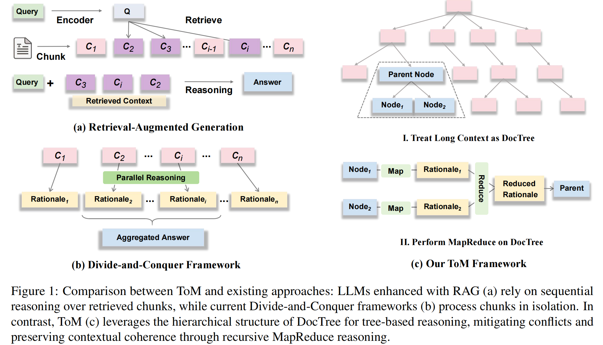
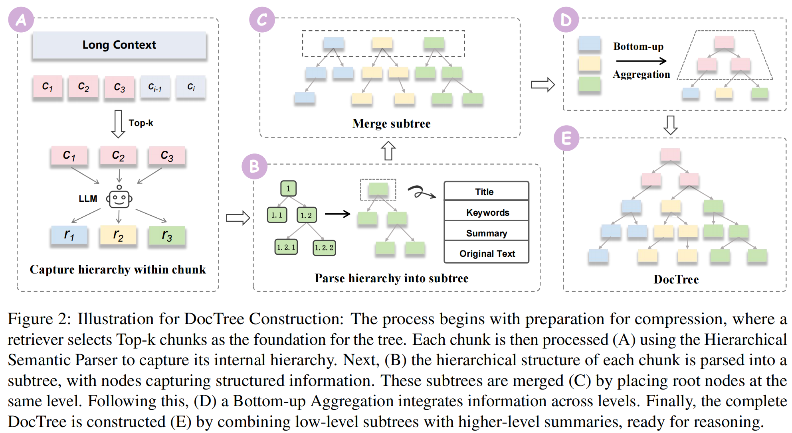

# ToM: Leveraging Tree-oriented MapReduce for Long-Context Reasoning in Large Language Models

> ✅ **Accepted by EMNLP 2025 (Main Conference)**  

- **Paper (arXiv)**: https://arxiv.org/abs/2511.00489  
- **Code**: https://github.com/gjn12-31/ToM

### 👥 Authors

**Jiani Guo** [(Homepage)](https://scholar.google.com/citations?user=fZ4lXDoAAAAJ&hl=zh-CN) * , **Zuchao Li** [(Homepage)](https://scholar.google.com/citations?user=PyzBf5oAAAAJ&hl=zh-CN) † , **Jie Wu** [(Homepage)](https://scholar.google.com/citations?user=mveolGMAAAAJ&hl=zh-CN) * , **Qianren Wang** , **Yun Li** , **Lefei Zhang** , **Hai Zhao** , **Yujiu Yang** 

\* Equal contribution ; † Corresponding authors


---

## 🚀 What is ToM?

<p align="center">
  
</p>


ToM is a **tree-oriented MapReduce framework** for **long-context reasoning** with Large Language Models (LLMs). It addresses the limitations of:

- **Retrieval-Augmented Generation (RAG)**, which relies on similarity-based ranking over flat chunks and often breaks logical coherence.
- **Divide-and-Conquer Frameworks (DCF)**, which process chunks in isolation and struggle to capture long-range dependencies or resolve conflicts across distant segments.

Instead of treating text as flat sequences, ToM constructs a **hierarchical DocTree** that mirrors natural document structure (headings → subtopics → details), then performs **recursive MapReduce reasoning**:

### **Core Workflow**

| Stage | Function |
|-------|----------|
| **Hierarchical Semantic Parsing (HSP)** | Converts each chunk into subtrees using weakly supervised structure extraction |
| **DocTree Construction** | Aggregates subtree roots bottom-up using clustering + summarization |
| **Tree-based MapReduce** | Map (local reasoning per node) → Reduce (conflict resolution & aggregation) |

<p align="center">
  
</p>

This enables **global reasoning across long-range dependencies**, avoids redundant reasoning, and yields higher factual consistency.

---

## 📊 Key Contributions

- **DocTree Representation** — preserves both fine-grained and global structure  
- **Conflict-aware MapReduce** — produces aggregated rationales with confidence scoring  
- **Efficient + Effective** — fewer API calls than some multi-agent baselines, better accuracy on 100k+ contexts  
- **Strong empirical results** on LongBench & InfiniteBench with GPT-4o, Qwen2.5-72B, DeepSeek-V3, DeepSeek-R1


---

## 📂 Project Layout

```
ToM/
├── HSP/
│   ├── main.py          # chunking + similarity filtering + HSP inference + tree merge
│   ├── raptor.py        # RAPTOR-style clustering and tree rebuilding
│   ├── util.py          # helpers for chunking, parsing, merging
│   └── prompts.py       # prompt templates for hierarchical semantic parsing
├── Reasoning/
│   ├── api.py           # DeepSeek / GPT-4o / qwq API wrappers
│   ├── pipeline.py      # async MapReduce reasoning pipeline over DocTree
│   ├── prompts.py       # map / reduce prompts
│   └── main.py          # batch processing entry point
├── Evaluate/
│   └── caculate_f1.py   # QA F1 scoring script
└── requirements.txt
```

---

## 🛠 Environment Setup

### 1. Install Dependencies

```bash
pip install -r requirements.txt
```

### 2. Export API Keys

```bash
export DEEPSEEK_API_KEY="your_key_here"
```

Modify `Reasoning/api.py` if needed.

---

## 🌲 HSP Module (`HSP/`)

### Run hierarchical parsing

```bash
python HSP/main.py
```

Set parameters in file, e.g.:

```python
input_file = "<path_to_JSONL>"
output_dir = "<directory>"
top_k_values = [3]
```

Outputs include:

| File | Purpose |
|------|---------|
| `structured_blocks.json` | chunk-level subtree structures |
| `processed_results_topk_*.json` | merged trees |

---

## 🧠 Tree-oriented MapReduce (`Reasoning/`)

### Configure

```python
config = {
    "input_path": "<tree_json>",
    "output_path": "<prediction_path>",
    "model_path": None,
    "max_workers": 4,
    "max_concurrent": 10
}
```

### Run reasoning

```bash
python Reasoning/main.py
```

Result example:

```json
{
  "question": "...",
  "prediction": "...",
  "structured_info": {
    "rationale": "...",
    "answer": "...",
    "confidence_score": 0.92
  }
}
```

---

## 📏 Evaluation

```bash
python Evaluate/caculate_f1.py
```

Input format:

```json
{
  "question": "...",
  "answer": ["..."],
  "prediction": "..."
}
```

---


## 📚 Citation

```bibtex
@inproceedings{guo-etal-2025-tom,
    title = "{T}o{M}: Leveraging Tree-oriented {M}ap{R}educe for Long-Context Reasoning in Large Language Models",
    author = "Guo, Jiani  and
      Li, Zuchao  and
      Wu, Jie  and
      Wang, Qianren  and
      Li, Yun  and
      Zhang, Lefei  and
      Zhao, Hai  and
      Yang, Yujiu",
    editor = "Christodoulopoulos, Christos  and
      Chakraborty, Tanmoy  and
      Rose, Carolyn  and
      Peng, Violet",
    booktitle = "Proceedings of the 2025 Conference on Empirical Methods in Natural Language Processing",
    publisher = "Association for Computational Linguistics",
    doi = "10.18653/v1/2025.emnlp-main.899",
    ISBN = "979-8-89176-332-6",
}

```


---

## 🤝 Contributing


Submit issues or PRs directly via GitHub.
